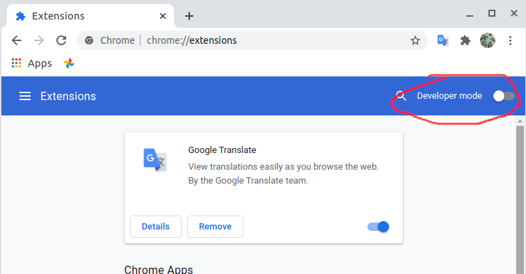
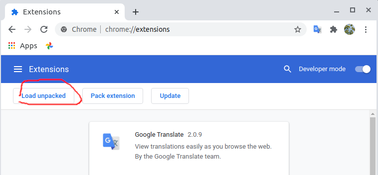
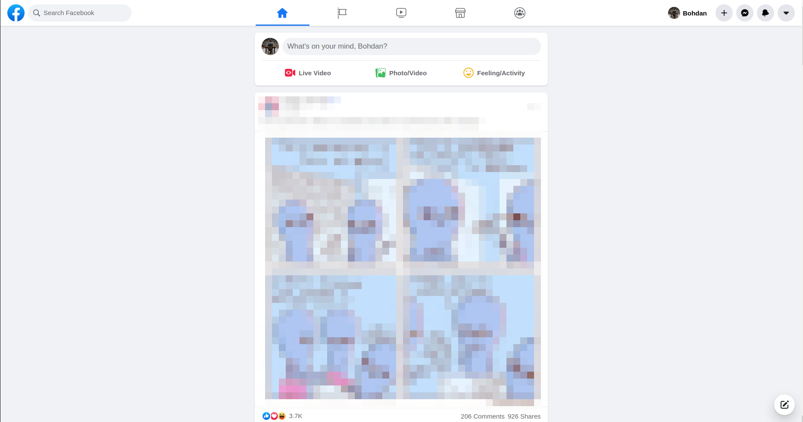

This is simple extension for chrome, created to delete junk on sides of FB feed

How to use
------------

* download and unpack 'extension' folder
* go to `chrome://extensions/ <chrome://extensions/>`_ page

* enable developer mode 

* click "Load unpacked" button and chose 'extension' folder

Intended view

TODO: 
------------

* upload to chrome store
* implement a UI for selecting items to remove
